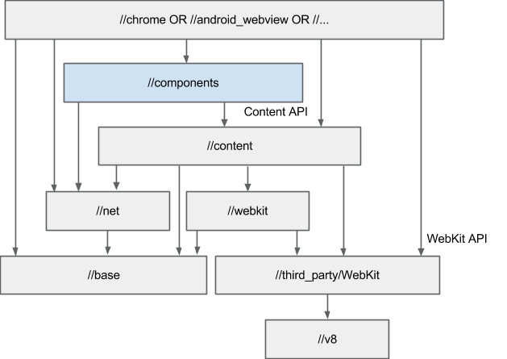

# web-platform
Build tools for WebPlatform related Components and Web Driven Platforms, Operating Systems, Embedded Devices.

Mainly this supplys the glue code for the modules: chromium-content and wpe-webkit as also a Graphical and Headless BuildManager for Chromium and Related Projects.
- chromium/src/content (webkit)
- chromium/src/content NPAPI / components / plugins
- chromium/src/webkit / WPE (content)
- chromium/src/third_party/webkit (content,chromium)

## Motivation
For Historical Reasons there existed a lot of Monolithical Solutions to build WebPlatforms but with today Distributed and Incremental Build Systems this does not scale and is not maintainable anymore. As the code has grown, features inevitably hooked into the wrong places, causing layering violations and dependencies that shouldn‘t exist. It’s been hard for developers to figure out what the “best” way is because the APIs (when they existed) and features were together in the same directory. To avoid this happening, and to add a clear separation between the core pieces of the code that render a page using a multi-process browser, consensus was reached to move rendering into its own module called content.

## content vs chromium
content should only contain code that is required to implement the web platform. Generally, a feature belongs in this category if and only if all of the following are true:

Its launch is tracked on the https://chromestatus.com/ dashboard.
It has an associated spec.
It is going through the feature development lifecycle.
In contrast, many features that are common to modern web platforms do not satisfy these criteria and thus, are not implemented in content. A non-exhaustive list:

Extensions
NaCl
SpellCheck
Autofill
Sync
Safe Browsing
Translate

Instead, these features are implemented in chromium, while content only provides generic extension points that allow these features to subscribe to the events they require. Some features will require adding new extension points: for more information, see How to Add New Features (without bloating RenderView/RenderViewHost/WebContents).

Since 2021 also a additional component system got put into place see the graphics above.

*** WARNING ****
As also importent when you code for embedded devices and confined desktop solutions you should consider at point of time to build and use pepper and NPAPI (Netscape Plugin API) and read about it: https://code.google.com/archive/p/ppapi/ it is a lower extension point supplyed via the plugins directory of the webkit layer that allows you to simply put binary extensions like it was done with flash and java into the build. You should never use this tech to deploy none Confined Desktop apps that interact with the public web or at last then you should be aware about binary exploration that means the machine can blow up any time and needs to be able to restore to a safe state also it should not hold any importent data like security keys when it acts with the public web you got warned!

Finally, there are a number of browser features that require interaction with online services supplied by the vendor, e.g. from the above list, Safe Browsing, Translate, Sync, and Autofill all require various network services to function. The chrome layer is the natural place to encapsulate that vendor-specific integration behavior. For the rare cases where a web platform feature implemented in content has a dependency on a network service (e.g. the network location service used by Geolocation), content should provide a way for the embedder to inject an endpoint (e.g. chromium might provide the service URL to use). The content module itself must remain generic, with no hardcoded vendor-specific logic.
